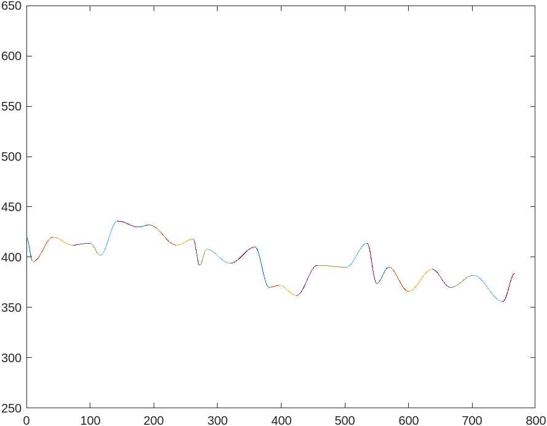

# windows test
A windows utility program to explore windows keyboard hooks and other operating
system-specific goodies like opacity changing and interacting with unfocused
windows.

# General Features
This is a (not very pretty) utility program to assist the user in accessing
various Windows OS features that are pretty handy but not accessible in any
normal way.

Here is a high level overview of the features I have currently added.

- Lock a window to be "always on top". Multiple windows can be added to this
    "always on top" layer.
- Adjust opacity of windows so that you can multitask on a single screen
    (Play a video in fullscreen then ALT+Tab your IDE on top to watch movies
    while you code on your laptop).
- Toggle remapping WASD to the arrow keys for some games or regular
    applications where this is more ergonomic and not available.
- Redirect scrolling to unfocused window so that you can scroll a text document
    / web browser while actively doing work / gaming in the focused window.
    - THIS IS CURRENTLY BUGGY AND DOESN'T APPLY TO SOME APPLICATIONS.
- Toggle an infinitely repeating human-like autoclicker with my custom
    clickWave (tm) technology.
    - NOT SCIENTIFICALLY RIGOROUS OR ACTUALLY TRADEMARKED
    - Modeled after my own click patterns to a statistically significant degree!
    - Will use my own in-house clickWave (tm) technology to generate
        oscillating patterns of click waves between a certain threshold and
        repeatedly click forever until you turn it off!
    - Will also jiggle the mouse around by a couple pixels every so often so
        that it will eventually drift and fail like a real person if left
        unattended.

# Setup and Use
I will repeat again at the outset that this is a Windows program that uses
Windows-specific datastructures and OS features.

Once compiled, there is a single launcher executable that will create a new
"hub window" that is responsible for executing all interactions with the user.
The hub window does not need to be focused for any of the commands to work, it
is mainly there just so the user can see that what they did was successful.

This application works by registering a swath of windows keyboard hooks that
the user can toggle on or off at any time.

Here are the currently implemented hooks and their behaviors:
- ALT + UP_ARROW
    - Set the currently focused window to be "always on top" of other windows
    - Multiple windows can simultaneously be selected in this way, and they will
        tile on top of each other but not regular windows 

- ALT + DOWN_ARROW
    - Remove "always on top" from the currently focused window

- ALT + "+" / ALT + "-"
    - Increment the opacity of the currently selected window about 4% per press.
    - Opacity is modeled as a integer value up to 255, and each press increments
        or decrements this value by 10.
    - Incrementing over the edge will overflow opacity and cause it to wrap
        around to the other side.
    - Internally sets the WS_EX_LAYERED window style on the selected window to
        achieve transparency.

- ATL + BACKSPACE
    - Immediately reset window opacity back to 100%.
    - Internally removes the WS_EX_LAYERED window style from the window.

- ALT + "Q"
    - Remap the "wasd" keys to the arrow keys, so that pressing "w" will send an
        up arrow, "a" will send a left arrow, etc.
    - Works for single presses as well as key holds.
    - Enter combination again to toggle off.

- ALT + "L"
    - TODO CURRENTLY SLIGHTLY BUGGY / INCONSISTENT
    - Designate a "scroll target" window and activate "scroll target" mode.
    - Allows the user to scroll an unfocused window by selecting it with this
        combination and then holding ALT and scrolling their mousewheel while
        another window is focused.
    - Currently only works with some applications and not others, at least works
        in VSCode.

- ALT + "E"
    - TODO on untoggle join autoclicker thread if exists.
    - Toggle autoclicker "ready" mode.
    - Similiar to the cruise control in your car, there is a double-lockout on
        the autoclicker I have included with this project.
    - Toggling this mode will activate the down arrow (is not affected by the
        wasd arrow key hook) into starting or stoping an autoclicker thread.
    - See the autoclicker details section for details on the timing and features
        of the autoclicker.

# Autoclicker Details
The autoclicker aims to mimic human behavior by dynamically varying its click
patterns and timings.  It does this by creating a patchwork of "fuzzy cosine"
waves that feed into each other and provide a randomly distributed path of click
timings.

Here is a sample "clickWave" that demonstrates the time between clicks.

To explain breifly, a starter wave is created with a midpoint around 300ms
with a random amplitude from 15 to 25ms and a period between 20 and 95 clicks.

I then follow this wave for half its period (top to bottom), and then create a
new wave using the end of the last wave as the beginning of the new wave, and
so on until I have populated a sufficient number of waves.

"Upwards" waves must have a midpoint of at most 500ms, and "downward" waves must
have a midpoint of at least 300ms.  These are magic values obtained through
analysis of my own repetetive clicking patterns.

Once we have our clickWaves created, we simply loop through them, using the
current value of the cosine function we are on as a baseline and adding a little
random noise (~100ms) above or below.  I use a nominal 1-11ms value as the
hold time of the mouse button for every click.

Finally, each click has a 2% chance of being designated a long click which
ignores the cosine value calculated above and waits for about 600ms.

Further, I have added a random wiggle generator that will slightly bobble the
cursor approximately once every 300 clicks to any pixel in a 3x3 grid around
its current position.  There is no bounds detecting included and if left
unattended your cursor will eventually stray from its target, just like if you
were sat there manually clicking while watching a movie on the other screen.